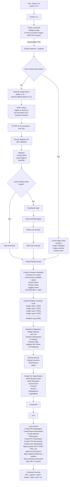

# Docker `run` Full Execution Flow

```mermaid
flowchart TD
    U[User: docker run python:3.12] --> CLI[Docker CLI]

    CLI --> CLI_STEPS["Parse command
Validate syntax
Convert to Docker Engine REST API request"]

    CLI_STEPS -->|Unix Socket / TCP| DAEMON[Docker Daemon - dockerd]

    DAEMON --> CHECK{Does image exist locally?}

    %% ---------- LOCAL IMAGE PATH ----------
    CHECK -->|Yes| LOCAL["Local Image Store
overlay2
image metadata
image manifest
content store"]

    %% ---------- PULL WORKFLOW ----------
    CHECK -->|No| RESOLVE["Resolve Image Name
python:3.12 → docker.io/library/python:3.12"]

    RESOLVE --> DNS["DNS Lookup
registry-1.docker.io
via /etc/resolv.conf / systemd-resolved"]

    DNS --> TLS[HTTPS TLS Connection - Port 443]

    TLS --> REGISTRY["Docker Registry API
GET Manifest"]

    REGISTRY --> MANIFEST["Manifest
Config JSON
Layer Digests
SHA256"]

    MANIFEST --> COMPARE{Layer already exists locally?}

    COMPARE -->|Yes| SKIP[Skip Download]
    COMPARE -->|No| DOWNLOAD[Download Layer]

    DOWNLOAD --> VERIFY[Verify SHA256 Digest]
    VERIFY --> EXTRACT[Extract Tar Archive]
    EXTRACT --> STORE[Store into overlay2]

    SKIP --> READY[Image Ready Locally]
    STORE --> READY
    LOCAL --> READY

    %% ---------- CONTAINER CREATION ----------
    READY --> META["Create Container Metadata
Container ID / Name
Environment Variables
Labels
Mount Points
Restart Policy
Logging Driver
ENTRYPOINT / CMD"]

    META --> LAYER["Create Writable Container Layer
Image Layer 1 (RO)
Image Layer 2 (RO)
Image Layer 3 (RO)
Image Layer 4 (RO)
-----------------------
Writable Layer (RW)"]

    LAYER --> NET["Network Initialization
Bridge Network
veth Pair
Network Namespace
IP Address
Routing Table
iptables NAT Rules
Port Mapping"]

    NET --> VOL["Volume Mounts
Named Volumes
Bind Mounts
tmpfs"]

    VOL --> OCI["Create OCI Specification
JSON Runtime Spec
Root Filesystem
Environment
Process
Mounts
Namespaces
Capabilities"]

    OCI --> CONTAINERD[containerd]
    CONTAINERD --> RUNC[runc]

    RUNC --> KERNEL["Linux Kernel
Create PID Namespace
Create Mount Namespace
Create Network Namespace
Create IPC Namespace
Create UTS Namespace
Create User Namespace
Apply cgroups (CPU, RAM, PIDs, IO)
Apply seccomp filters
Apply AppArmor/SELinux profiles
Mount Overlay Filesystem
Start PID 1 Process"]

    KERNEL --> RUNNING["Container Running
PID 1: python / nginx / dotnet / node / java / etc."]
```